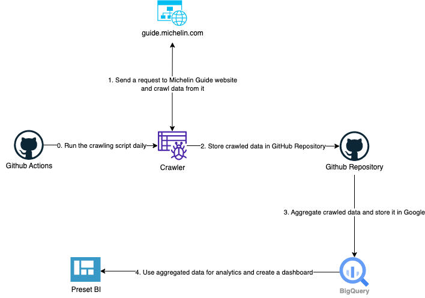
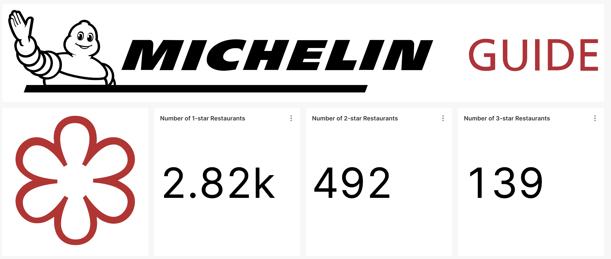
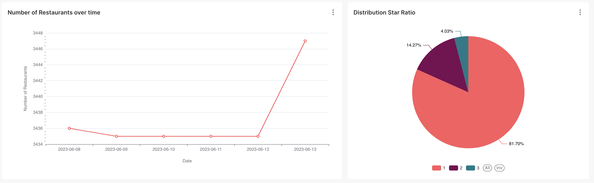
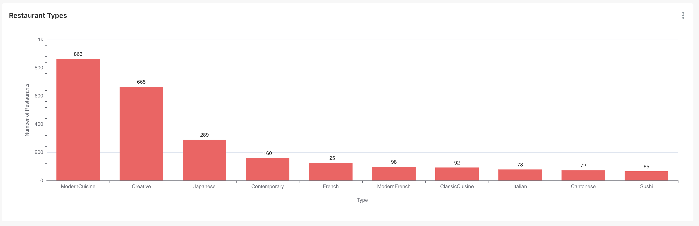
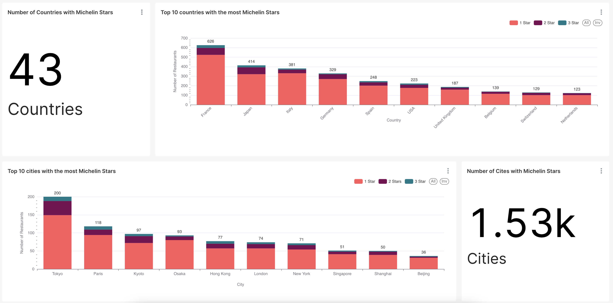
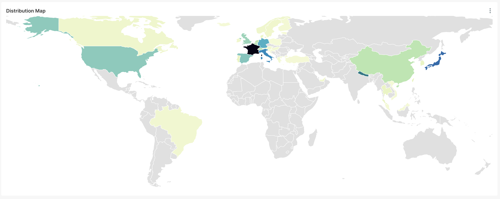
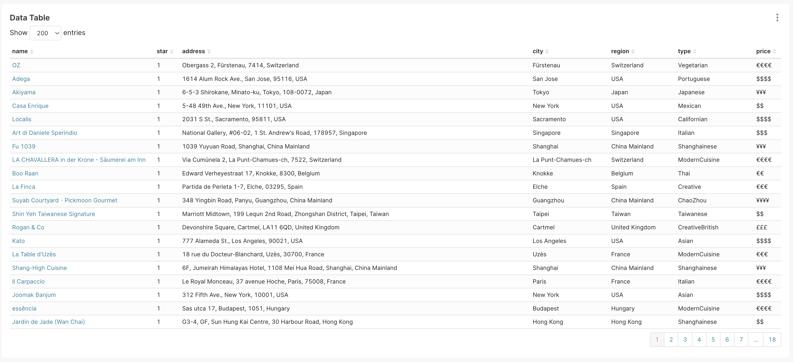

# Analyze Michelin Star Data

## Introduction


The Michelin star, a symbol of culinary excellence, is awarded by the renowned Michelin Guide to exceptional restaurants worldwide. It signifies the highest level of culinary artistry, innovation, and dedication to delivering an extraordinary gastronomic experience.

## Method

### Tools
- Python
- Github Actions
- Google BigQuery
- Preset (Power by Superset)

### Flows
- Automatic daily crawling script execution is facilitated by `GitHub Actions`
- A `Python` crawling script is used to create a crawler that retrieves data from https://guide.michelin.com/
- The received data from crawler is stored in this `GitHub Repository`
- The data is then aggregated and stored on `Google BigQuery Storage`
- The aggregated data is sent to a `Preset` to create a dashboard



### Example data

```json
{
  "name": "Gia",
  "image": "https://axwwgrkdco.cloudimg.io/v7/__gmpics__/457621bc87e04bda821906e31ffaa9d0",
  "price": {
    "raw": "₫₫₫₫",
    "symbol": "₫",
    "rate": 4
  },
  "type": "VietnameseContemporary",
  "awards": {
    "star": 1,
    "is_green_star": false,
    "is_bib_gourmand": false
  },
  "position": {
    "location": {
      "region": "Vietnam",
      "city": "Hanoi"
    },
    "latitude": "21.0276189",
    "longtitude": "105.8360833"
  },
  "link": "https://guide.michelin.com/at/en/ha-noi/ha-noi_2974158/restaurant/gia-1202148",
  "address": "61 Van Mieu Street, Dong Da, Hanoi, Vietnam",
  "phone": "84896682996",
  "website": "https://gia-hanoi.com",
  "opening_hours": [
    "closed",
    "18:00-21:00",
    "18:00-21:00",
    "18:00-21:00",
    "11:30-13:30 18:00-21:00",
    "11:30-13:30 18:00-21:00",
    "11:30-13:30 18:00-21:00"
  ],
  "description": "Gia đình, meaning \"family\", is a reference to chef Sam Tran and partner Long Tran's longing for their homeland during their years working abroad. The restaurant decor draws inspiration from the Temple of Literature just across the road. Their 12-course set menu changes with the seasons and is informed by Vietnamese culinary heritage. Deceptively complex, the beautifully crafted dishes showcase well-judged combinations of subtle flavours, with acidity and texture playing prominent roles. ",
  "facilities_and_services": [
    "Air conditioning",
    "American Express credit card",
    "Credit card / Debit card accepted",
    "JCB",
    "Mastercard credit card",
    "Visa credit card"
  ],
  "created_at": "2023-06-08",
  "updated_at": "2023-06-08"
}
```

## Run
- Install Python (3.10.11)
- Install Dependencies: `pip3 install -r requirements.txt`
- Run crawling script: `python index.py`

### Others
- Aggregate data: `python aggregator.py`
- Store aggregated data on Google BigQuery Storage `python load_into_gcb.py`

> You need to go to Google Cloud -> IAM & Admin -> Service Accounts -> Create Service Account -> Create new key (JSON). And then save it (JSON keys) to the credential folder with the filename 'gcb-credentials.json'.

## [Dashboard 📎](https://157fedb3.us2a.app.preset.io/superset/dashboard/michelin-star-data/?native_filters_key=6lQrP3amBbhtcFQ5HpPwUdH_Xv89wr-pnLW-YarunA1rr7jUMk6aYA76YrKqV5qZ)








